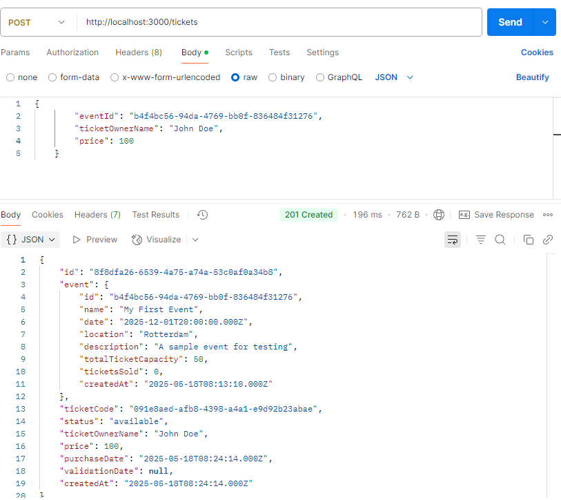
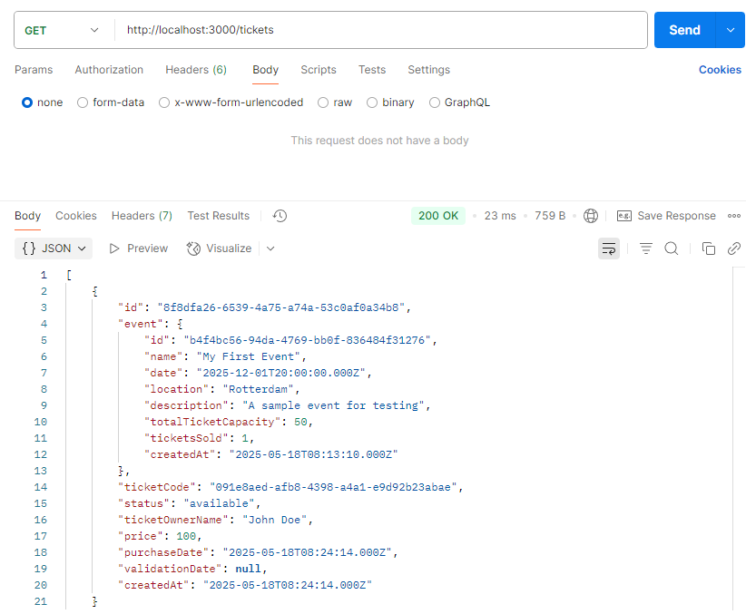
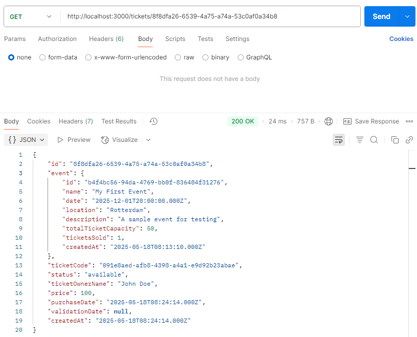
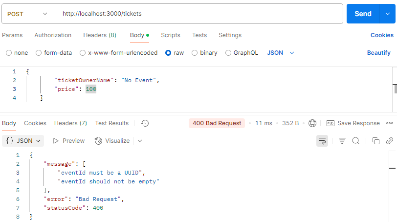
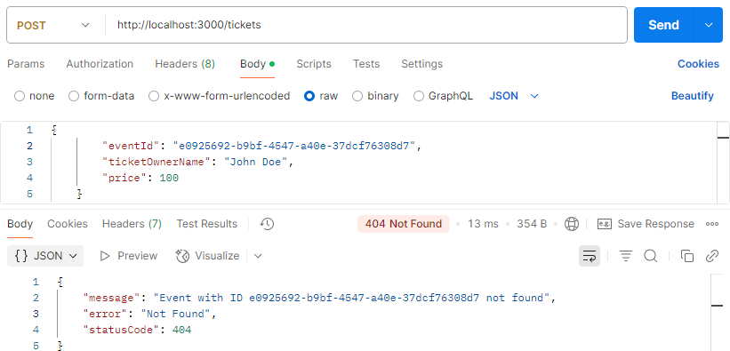
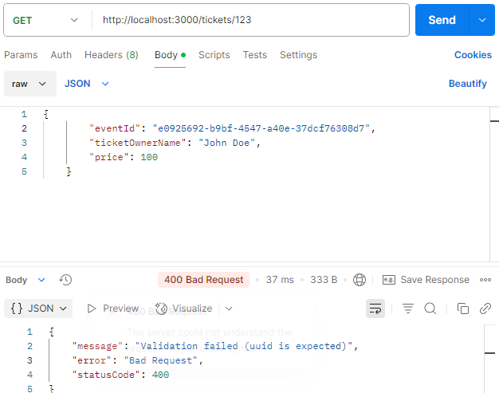

## Ticket Management API

A RESTful API for managing event tickets, built with the NestJS framework.
The API allows clients to create, retrieve, and validate tickets for events, while maintaining ticket counts associated with each event.

The project demonstrates backend development concepts such as:

- RESTful API design
- Input validation and error handling
- Database integration using SQLite
- Modular architecture with NestJS
- API testing using Postman
- Automated testing with unit and end-to-end tests

The API automatically updates the number of tickets sold for an event whenever a new ticket is created.

## Project setup
Clone the repository and install the required dependencies:

```bash
$ npm install
```

## Running the Application
The application can be started in several modes depending on the development stage.

```bash
# development
$ npm run start

# watch mode
$ npm run start:dev

# production mode
$ npm run start:prod
```
## Database
The project uses SQLite as a lightweight database for storing:
- Events
- Tickets

For testing purposes, an event record was manually inserted into the database so that tickets can be created and linked to an existing event.

Each ticket contains:
- `id` – unique ticket identifier
- `eventId` – the event associated with the ticket
- `name` – name of the ticket holder
- `email` – contact email for the ticket holder

When a ticket is successfully created, the ticket counter for the associated event is automatically incremented.

## Running Tests
The project includes automated tests to ensure the API works correctly.

```bash
# unit tests
$ npm run test

# e2e tests
$ npm run test:e2e

# test coverage
$ npm run test:cov
```

## API Endpoints test with Postman
I have manually added an event record in the the SQLite database which I use in the dndpoints below.
### POST /tickets
Creates a new ticket.


### GET /tickets
Retrieve all tickets in the database.

The number of tickets sold for the event has also been updated.


### GET /tickets/:id
Retrieve a ticket by ID.


### POST - Create ticket with missing field


### POST - Create ticket with non-existent eventId


### GET - Get ticket with invalid ID format

