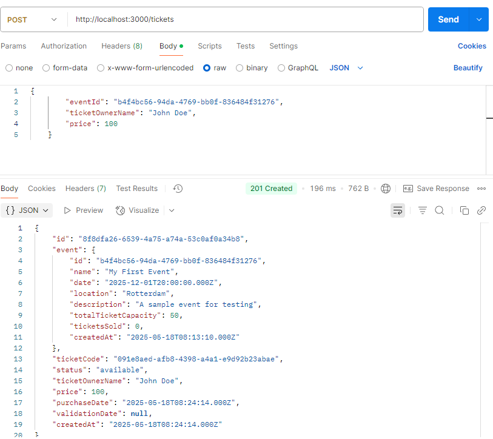

## Ticket management API

A simple REST API for creating and retrieving ticket, built using the [NestJS](https://github.com/nestjs/nest) framework.

## Project setup

```bash
$ npm install
```

## Compile and run the project

```bash
# development
$ npm run start

# watch mode
$ npm run start:dev

# production mode
$ npm run start:prod
```

## Run tests

```bash
# unit tests
$ npm run test

# e2e tests
$ npm run test:e2e

# test coverage
$ npm run test:cov
```

## API Endpoints test with Postman
I have manually added an event record in the the SQLite database which I use for the tickets endpoints.
### POST /tickets
Creates a new ticket.


### GET /tickets
Retrieve all tickets in the database.

The number of tickets sold for the event has also been updated.


### GET /tickets/:id
Retrieve a ticket by ID.
